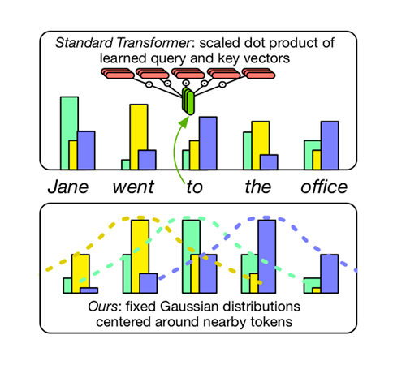

# StupidNMT: Hard-Coded Gaussian Attention for Neural Machine Translation

This is the official repository which contains all the code necessary to
replicate the results from the ACL 2020 long paper *[Hard-Coded Gaussian Attention for Neural Machine Translation](https://www.aclweb.org/anthology/2020.acl-main.687/)*. It can also be used to
train a vanilla Transformer.

The full model architecture is displayed below:



Our approach uses hard-coded Gaussian distribution instead of learned attention to simplify the Transformer architecture in neural machine translation (NMT). We replace the multi-headed attention, computed by query and key, by a fixed Gaussian distribution that focuses on the current word or somewhere near it. The figure above demonstrates how our attention differs from the vanilla Tranformer.

This code base is adapted from [synst](https://github.com/dojoteef/synst).

## Requirements

The code requires Python 3.7+. The python dependencies can be installed with the
command (using a virtual environment is highly recommended):

```sh
pip install -r requirements.txt
```

If you want to use the scripts that wrap `multi-bleu.perl` and
`sacrebleu`, then you'll need to have
[Moses-SMT](https://github.com/moses-smt/mosesdecoder) available as well.

## Basic Usage

The code has one main entry point `main.py` with a couple of support scripts for
the analysis conducted in the paper. Please use `python main.py -h` for
additional options not listed below. You can also use `python main.py <action>
-h` for options specific to the available actions: `{train, evaluate, translate,
pass}`.

### Preprocessing

Preprocessing for wmt_en_de, wmt_en_fr and iwslt_en_de are the same as in synst:

```sh
python main.py --dataset wmt_en_de -d raw/wmt -p preprocessed/wmt -v pass
```

We also added IWSLT En-Ja and WMT En-Ro datasets and you can process them by the following commands.

We need subword-nmt to process subwords for both En-Ja and En-Ro. WMT16-scripts is also needed for standard processing. Mosesdecoder is needed for tokenization. We download them with the following commands to directory of our choices and set the environment variables to those directories:

```sh
git clone https://github.com/rsennrich/subword-nmt.git
git clone https://github.com/rsennrich/wmt16-scripts.git
git clone https://github.com/moses-smt/mosesdecoder.git
export SUBWORD=subword-nmt
export WMT16_SCRIPTS=wmt16-scripts
export MOSES=mosesdecoder
```

Then, we can download data for each dataset and process them by the following commands.

En-Ja:

```sh
mkdir /data/en_ja_tmp
mkdir /data/en_ja
RAW_PATH=/data/en_ja_tmp PROCESS_PATH=/data/en_ja bash process_new_data/process_enja.sh
```

En-Ro:
```sh
mkdir /data/en_ro_tmp
mkdir /data/en_ro
RAW_PATH=/data/en_ja_tmp PROCESS_PATH=/data/en_ro bash process_new_data/process_enro.sh
```

Please note that our preprocessing of En-Ja is not the standard way for IWSLT En-Ja dataset, so the results might be different from other works.

### Training

Assuming you have access to 8 1080Ti GPUs you can recreate the results for hard-coded self-attention model on the WMT'14 En-De dataset with:

```sh
python main.py -b 3175 --dataset wmt_en_de \
  --model new_transformer \
  --enc-attn-type normal --enc-attn-offset -1 1 \
  --dec-attn-type normal --dec-attn-offset -1 0 \
  -d raw/wmt -p preprocessed/wmt -v train \
  --checkpoint-interval 1200 --accumulate 2 \
  --checkpoint-directory experiments/wmt_en_de_01
```

The above commandline will train 8 GPUs with approximately 3175 source/target
tokens combined per GPU, and accumulate the gradients over two batches before
updating model parameters (leading to ~50.8k tokens per model update).

You can also recreate results on IWSLT'16 En-De dataset for hard-coded all attention model on 1 1080Ti GPU with:

```sh
python main.py -b 6000 --dataset iwslt_en_de \
  --model new_transformer \
  --enc-attn-type normal --enc-attn-offset -1 1 \
  --dec-attn-type normal --dec-attn-offset -1 0 \
  --enc-dec-attn-type normal --enc-dec-attn-offset -1 1 \
  --embedding-size 288 --hidden-dim 507 --num-heads 4 --num-layers 5 \
  -d raw/wmt -p preprocessed/wmt -v train \
  --checkpoint-interval 600 --accumulate 1 \
  --checkpoint-directory experiments/iwslt_en_de_01 \
  --label-smoothing 0.0 --learning-rate-scheduler linear --learning-rate 3e-4
```

To recreate results for single head cross-attention, you can run:

```sh
python main.py -b 6000 --dataset iwslt_en_de \
  --model new_transformer \
  --enc-attn-type normal --enc-attn-offset -1 1 \
  --dec-attn-type normal --dec-attn-offset -1 0 \
  --enc-dec-attn-type learned \
  --enc-dec-attn-layer 0 0 0 0 1 --enc-dec-attn-num-heads 0 0 0 0 1 \
  --embedding-size 288 --hidden-dim 507 --num-heads 4 --num-layers 5 \
  -d raw/wmt -p preprocessed/wmt -v train \
  --checkpoint-interval 600 --accumulate 1 \
  --checkpoint-directory experiments/iwslt_en_de_01 \
  --label-smoothing 0.0 --learning-rate-scheduler linear --learning-rate 3e-4
```

The default model is the Transformer model. If you want to train a vanilla Tranformer model on the WMT'14 De-En dataset, you can run this:

```sh
python main.py -b 3175 --dataset wmt_de_en \
  -d raw/wmt -p preprocessed/wmt -v train \
  --checkpoint-interval 1200 --accumulate 2
```

### Evalulating Perplexity

You can run a separate process to evaluate each new checkpoint generated during
training (you may either want to do it on a GPU not used for training or disable
cuda as done below):

```sh
python main.py -b 5000 --dataset wmt_en_de \
  --model new_transformer -d raw/wmt -p preprocessed/wmt \
  --enc-attn-type normal --enc-attn-offset -1 1 \
  --dec-attn-type normal --dec-attn-offset -1 0 \
  --split valid --disable-cuda -v evaluate \
  --watch-directory /tmp/stupidnmt/checkpoints
```

### Translating

After training a model, you can generate translations with the following
command (currently only translation on a single GPU is supported):

```sh
CUDA_VISIBLE_DEVICES=0 python main.py --dataset wmt_en_de \
  --model new_transformer \
  --enc-attn-type normal --enc-attn-offset -1 1 \
  --dec-attn-type normal --dec-attn-offset -1 0 \
  -d raw/wmt -p preprocessed/wmt \
  --batch-size 1 --batch-method example --split test \
  --restore /tmp/stupidnmt/checkpoints/checkpoint.pt \
  --average-checkpoints 5 translate \
  --max-decode-length 50 --length-basis input_lens --order-output
```

Which by default, will output translations to `/tmp/stupidnmt/output`.

### Experiment tracking

If you have a [comet.ml](https://comet.ml) account, on you can track
experiments, by prefixing the script call with:

```sh
env $(cat ~/.comet.ml | xargs) python main.py --track ...
```

Where `~/.comet.ml` is the file which contains your API key for logging
experiments on the service. By default, this will track experiments in a
workspace named `umass-nlp` with project name `probe-transformer`. See `args.py` in order to
configure the experiment tracking to suit your needs.

## Cite

```
@inproceedings{you-etal-2020-hard,
    title = "Hard-Coded {G}aussian Attention for Neural Machine Translation",
    author = "You, Weiqiu  and
      Sun, Simeng  and
      Iyyer, Mohit",
    booktitle = "Proceedings of the 58th Annual Meeting of the Association for Computational Linguistics",
    month = jul,
    year = "2020",
    address = "Online",
    publisher = "Association for Computational Linguistics",
    url = "https://www.aclweb.org/anthology/2020.acl-main.687",
    pages = "7689--7700",
    abstract = "Recent work has questioned the importance of the Transformer{'}s multi-headed attention for achieving high translation quality. We push further in this direction by developing a {``}hard-coded{''} attention variant without any learned parameters. Surprisingly, replacing all learned self-attention heads in the encoder and decoder with fixed, input-agnostic Gaussian distributions minimally impacts BLEU scores across four different language pairs. However, additionally, hard-coding cross attention (which connects the decoder to the encoder) significantly lowers BLEU, suggesting that it is more important than self-attention. Much of this BLEU drop can be recovered by adding just a single learned cross attention head to an otherwise hard-coded Transformer. Taken as a whole, our results offer insight into which components of the Transformer are actually important, which we hope will guide future work into the development of simpler and more efficient attention-based models.",
}
```
